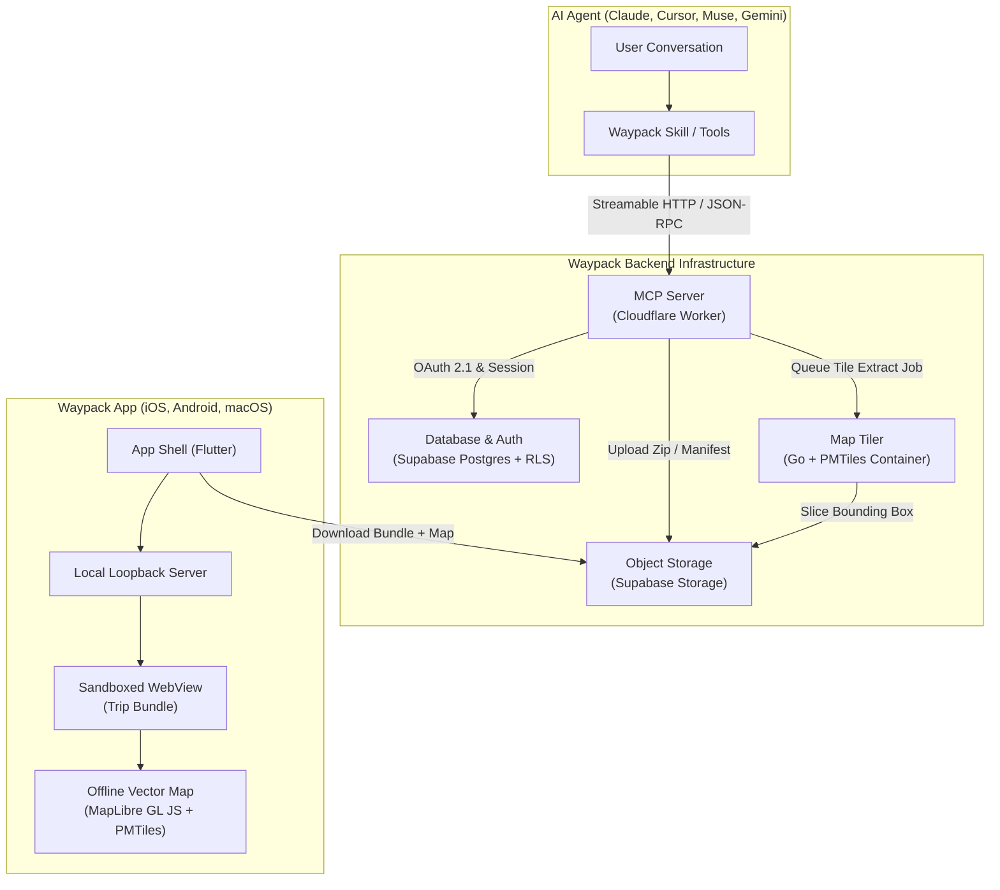

## System Architecture

Waypack bridges modern LLM coding and planning agents with real-world travel conditions where cellular signal is intermittent or non-existent.

---

## Subsystem Breakdown

### 1. Trip Bundle Format (`packages/bundle-schema`)
A trip plan is compiled into a static, deterministic zip archive:
* `manifest.json`: Structured source of truth (places, coordinates, routes, schedule, day-by-day activities, emergency contacts, metadata). Validated against JSON Schema v1.
* `index.html`: Entry point of the mobile web application.
* `assets/`: Self-contained JavaScript, CSS, and imagery.
* **Strict Offline CSP**: Prohibits any remote network calls, external fonts, iframes, or CDNs.

### 2. Client-Side Trip SDK (`packages/trip-sdk`)
Exposes `window.Waypack` to the sandboxed web view:
* **Vector Basemap**: Renders regional vector tiles from an offline `.pmtiles` archive using MapLibre GL JS with offline glyphs and sprites.
* **Native Bridges**: Hand-offs to Apple Maps / Google Maps coordinates (`Waypack.openInMaps`), `.ics` offline calendar exports (`Waypack.addToCalendar`), and GPS geolocation tracking.

### 3. Developer Toolchain (`packages/cli`)
The `@waypack/cli` npm package provides local development workflows:
* `waypack init <dir>`: Scaffolds a new trip bundle from starter templates.
* `waypack preview <dir>`: Launches a phone-sized local preview server with authentic Content Security Policy and live tile proxying.
* `waypack validate <dir>`: Verifies structural and schema compliance before publishing.
* `waypack screenshot <dir> [--manifest]`: Captures phone-sized screenshots of the trip into `listing/` for its store-style listing in the account portal.
* `waypack skill install`: Installs the agent skill directly to Claude Code and Cursor.

### 4. Remote MCP Server (`services/mcp`)
A horizontal, stateless Cloudflare Worker implementing the Model Context Protocol:
* Exposes tools: `geocode`, `compute_route`, `validate_bundle`, `push_preview`, `publish_preview`, `upload_bundle_inline`, `list_trips`, `get_trip_status`.
* **Live Previews**: Allows travelers to watch trip plans materialize in real-time on any device before final publishing.
* **Security**: PKCE OAuth 2.1 with Cloudflare OAuth Provider, signed upload/download URLs, and Row-Level Security (RLS).

### 5. Basemap Slicing Engine (`services/tiler`)
A containerized Go microservice:
* Mirrors planet-wide OpenStreetMap vector tiles monthly into R2.
* Receives trip bounding boxes (`bbox`) from the Cloudflare Queue.
* Extracts multi-zoom tile polygons into compact, standalone PMTiles files (~15–80 MB).

### 6. Mobile Viewer (`apps/mobile`)
Built with Flutter for iOS, Android, and macOS:
* Manages offline downloads and cryptographically verifies bundle checksums.
* Hosts bundles on a local loopback HTTP server with ephemeral security tokens.
* Features native Today dashboard, calendar integrations, and an Apple Intelligence on-device offline travel assistant.

---

## Further Reading

* [System Design & Technical Specification](/design): Deep dive into data structures, protocol flows, and security models.
* [Architectural Decisions (ADRs)](/DECISIONS): Complete index of all 55+ recorded architectural decisions and trade-offs.
* [Deployment Guide](/DEPLOY): Step-by-step instructions for deploying the backend, database, container tiler, and mobile apps.
* [Status & Roadmap](/STATUS): Current test coverage, verified platforms, and upcoming milestones.
